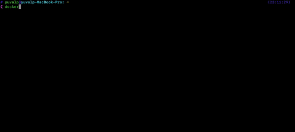

# Version Notifier</br>[](https://www.codacy.com/gh/yuvalpress/version-notifier/dashboard?utm_source=github.com&amp;utm_medium=referral&amp;utm_content=yuvalpress/version-notifier&amp;utm_campaign=Badge_Grade) [](https://github.com/yuvalpress/version-notifier/actions?query=workflow%3ADocker%20Build) [](https://github.com/yuvalpress/version-notifier/actions?query=workflow%3A%22Chart+Release%22)
🕷 **Version Notifier** - your Friendly Neighborhood Spiderman, only geeker 🤓

Version Notifier is a modern solution for the "being notified" aspect of each Techy's day-to-day work.
</br>By using it, you'll be notified for any new global GitHub repository release you choose, directly to your Slack channel.</br></br>

## Getting Started 🏁
You can deploy the application in one of two ways:
* **HELM**
</br> Download the latest release and deploy it to your Kubernetes cluster </br>
  ```shell
    
  ```

* **Docker Image**
</br> Create a dockerfile from the Version-Notifier base image and deploy it in as a standalone container:
  ```dockerfile
    # Name this file Dockerfile
    FROM yuvalpress/version-notifier:latest
    
    # You MUST Set this environment variables for the application to send notification to slack
    ENV SLACK_CHANNEL {{ value }}
    ENV SLACK_TOKEN {{ value }}
    
    # Optional
    ENV NOTIFY {{ value }}
  ```
  
  Build and Deploy:
  ```shell
    # Run this command from the Dockerfile dir
    docker build -t {{ value }} .
    docker run --name {{ value }}
  ```

## Configuration Options 🕹
`NOTIFY` - List represented as string with the following possible keywords: `major, minor, patch, all`
</br></br> Possible combinations:
  * "all" - `all` must be set alone
  * "major, patch" - only notify for `major` and `patch` version changes
  * "minor" - only notify about `minor` version changes

If not set, NOTIFY will be automatically set to `all`</br></br>

## Verification of Success 🎯
If the deployment was successful, you'll see the logs rolling out of your container: </br></br>
### Using Docker
If you executed Version Notifier using Docker, you'll see the logs roll after you run the container.

### Watch logs with kubernetes
```shell
pod=$(kubectl get pods -n notifier -l app=version-notifier -o yaml | yq '.items[0].metadata.name') && kubectl logs $pod -n notifier -f
```
