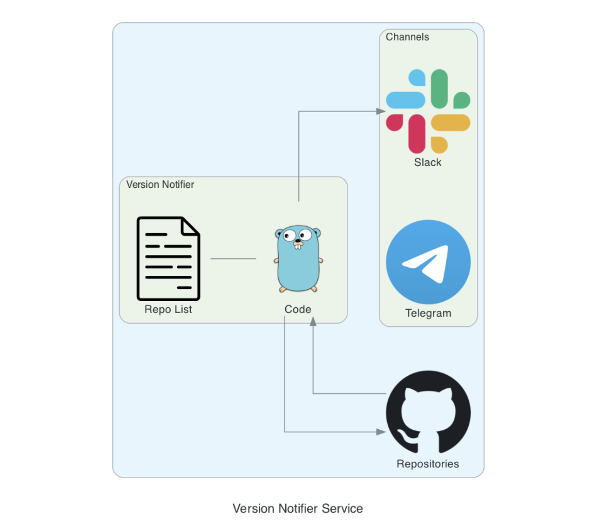
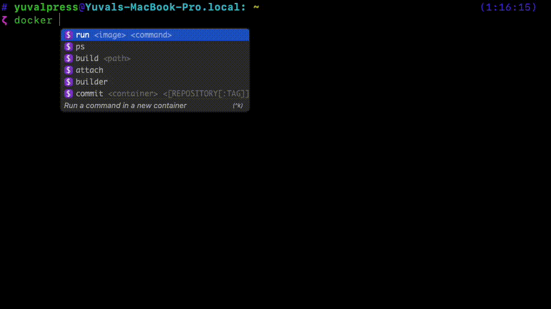

# Version Notifier [](https://twitter.com/intent/tweet?text=This+app+allows+you+to+stay+updated+about+GitHub+releases+you+choose%21+try+it+out+%3A%29&url=https://github.com/sirrend/version-notifier&via=devopschief&hashtags=golang,newversion,notification,devops,developers)
[](https://www.codacy.com/gh/sirrend/version-notifier/dashboard?utm_source=github.com&amp;utm_medium=referral&amp;utm_content=sirrend/version-notifier&amp;utm_campaign=Badge_Grade) [](https://github.com/sirrend/version-notifier/actions?query=workflow%3ADocker%20Build) [](https://github.com/sirrend/version-notifier/actions?query=workflow%3A%22Chart+Release%22) [](https://opensource.org/licenses/Apache-2.0)</br>
🕷 **Version Notifier** - your Friendly Neighborhood Spiderman, only geekier 🤓

Version Notifier is a modern solution for the "being notified" aspect of each Techy's day-to-day work.
</br>By using it, you'll be notified for any new global GitHub repository release or tag you choose, directly to your Slack / Telegram channel.</br></br>


## NOTE ⚠️
Starting from image version 1.0.0, a use of the GitHub API is made.</br>
As a result, a GitHub OAuth token is needed to perform requests.</br>
This is because the last used method (site scraping) caused receiving the `You have triggered an abuse detection mechanism` error from the GitHub servers.

The GitHub API have a rate limit, which is different depends on the type of GitHub account you own.
* Personal: 60 requests per hour per repository
* Organization: 5000 requests per hour 
* Enterprise: 5000 requests per hour

[Use this link to create a GitHub private token.](https://docs.github.com/en/enterprise-server@3.4/authentication/keeping-your-account-and-data-secure/creating-a-personal-access-token)

## Getting Started 🏁
You can deploy the application in one of two ways:</br>
### HELM
Download the latest release and deploy it to your Kubernetes cluster </br>
  ```shell
    helm repo add vnotifier https://sirrend.github.io/version-notifier
    
    kubectl create ns notifier
    helm install version-notifier vnotifier/version-notifier -n notifier --set secret.values.SLACK_TOKEN="dmFsdWU=" --set secret.values.SLACK_CHANNEL="dmFsdWU="
  ```

### Docker Image
Create a dockerfile from the Version-Notifier base image and deploy it as a standalone container:
  ```dockerfile
    # Name this file Dockerfile
    FROM sirrend/version-notifier:latest
    
    # NOTE - Set only one method - slack or telegram - not both
    # You MUST Set this environment variables for the application to send notification to slack
    ENV NOTIFICATION_METHOD slack
    ENV SLACK_CHANNEL {{ value }}
    ENV SLACK_TOKEN {{ value }}
    
    # You MUST Set this environment variables for the application to send notification to telegram
    ENV NOTIFICATION_METHOD telegram
    ENV TELEGRAM_TOKEN {{ value }}
    ENV TELEGRAM_CHAT_ID {{ value }}

    # Optional
    ENV NOTIFY {{ value }}
    ENV SEND_FULL_CHANGELOG {{ value }}
    ENV INTERVAL {{ value }}
  ```
  
  Build and Deploy:
  ```shell
    # Run this command from the Dockerfile dir
    docker build -t {{ value }} .
    docker run --name {{ value }}
  ```
</br></br>
## Configuration Options 🕹
### NOTIFY
List represented as string with the following possible keywords: `major, minor, patch, all`
</br>This value can be set in both HELM values.yaml file under `application.notify` and as environment variable in your custom Dockerfile.
</br></br> Possible combinations:
  * "all" - `all` must be set alone
  * "major, patch" - only notify for `major` and `patch` version changes
  * "minor" - only notify about `minor` version changes

If not set, NOTIFY will be automatically set to `all`</br></br>

### SEND_FULL_CHANGELOG
Boolean value represented as a string: `true` or `false`</br>
This environment variable is responsible for the form of the message to be sent.</br>

### INTERVAL
Integer value represented as a string.</br>
This environment variable is responsible for the requests rate and is defaulted to 20 minutes.</br></br>
**This environment variable is being treated as minutes.**</br>
Example:
```text
INTERVAL=30 -> 30 minutes
```

## Verification of Success 🎯
If the deployment was successful, you'll see the logs rolling out of your container:
### Using Docker
If you executed Version Notifier using Docker, you'll see the logs roll after you run the container.</br></br>


### Watch logs with kubernetes
```shell
pod=$(kubectl get pods -n notifier -l app=version-notifier -o yaml | yq '.items[0].metadata.name') && kubectl logs $pod -n notifier -f
```

## Upcoming Features ✨
* Support more than one notification method at a time.
* Add support for Pypi repositories
* Add support for Docker Images in Dockerhub

## Want to contribute? 💻
PR's are more than welcome!

#### Steps:
1. Open a branch in the following form: `feature/<feature_name>`.
2. Make sure to bump the Docker Image version by incrementing the version inside the docker.version file.
3. Open PR!
